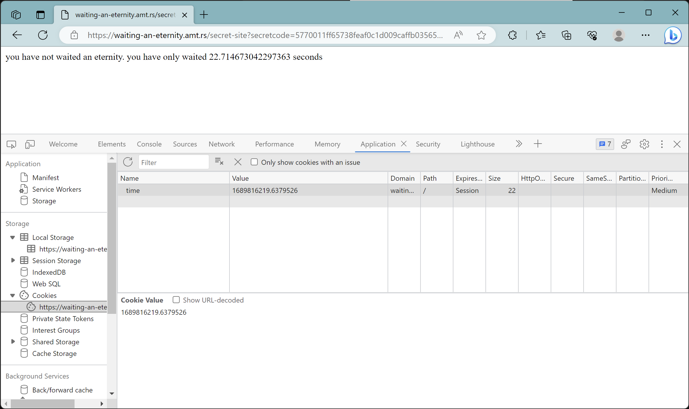
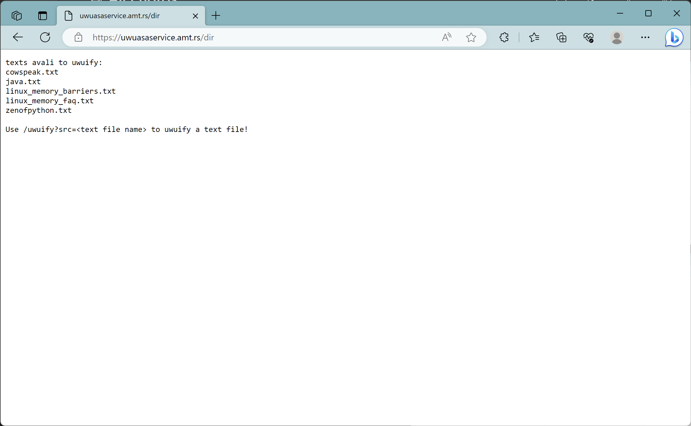
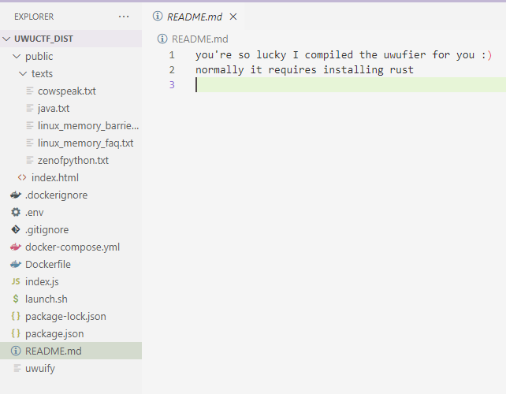
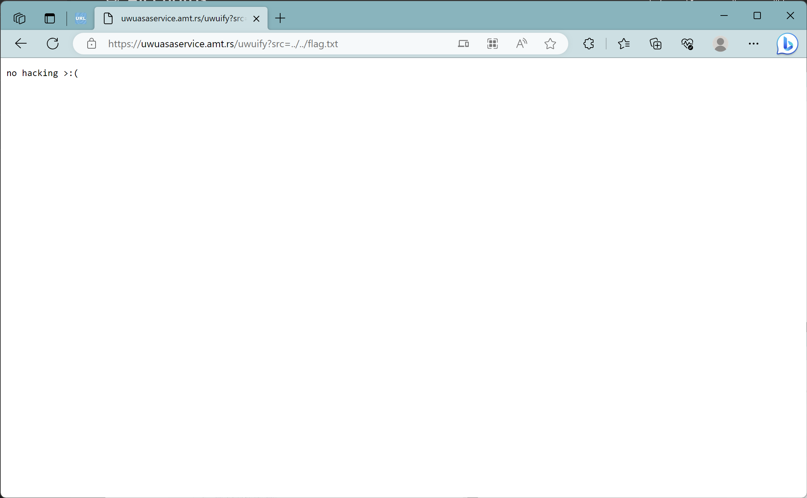

# AmateursCTF 2023 - Journey of Novices

In a team of six University Students from The University of Guyana's Cybersecurity [Club](https://www.instagram.com/uogcyberclub/), charge was taken at few of the challenges in the AmateursCTF 2023 where the team concluded in the top 30% across more than 800 teams.

The challenge questions our team document are brief and as follows:
1. misc/Discord rules sanity check
2. web/waiting-an-eternity
3. web/funny factorials
4. web/uwuctf

## misc/Discord rules sanity check

Of course, we read the fine print and this was the easiest since we came on board in the CTF's discord server for hints.


One flag down and that's 10 points to the team: **amateursCTF{be_honest._did_you_actually_read_the_rules?}**

## web/waiting-an-eternity

This challenge took us to a simple webpage that was rather interesting and empty at the same time to convince us to actually wait for a flag.


Looking at the response headers from the website gives a secret path and a paramenter, _secretcode_:


### Waiting another eternity?

Our new webpage is even more interesting but nothing new is returned in the response headers to have us pivot to our flag.


> But wait! After reloading the page sometime later, there's a cookie titled _time_ that specifies what seems to store the time that we have spent with the webpage open after .



Plugging in the classic CheatEngine digits infinity 9999999's as the cookie value gave us a negative time now in the webpage's response:


Shall we just make the cookie value larger and make it negative? Good ol maths.


> Piece of cake. On to the next.

# web/funny factorials

This challenge gives us a simple Factorial Calculator tool with light and dark mode that we can click to change or play with in the `?theme=<theme.css>` parameter.


Looking at the Dockerfile on this CTF site for this challenge we see the following workable directories and the location of the flag on the webserver:

```docker
FROM python:3.10-slim-buster

RUN pip3 install flask
COPY flag.txt /

WORKDIR /app
COPY app/* /app/
copy app/templates/* /app/templates/
copy app/themes/* /app/themes/

EXPOSE 5000

ENTRYPOINT ["python3", "app.py"]
```

In an attempt to escape the current directory, `/themes` to the root folder on the webserver `/` and locate the flag we execute the following in the `?theme=` parameter:

> ../../flag.txt

We encounter the following roadblock:


We review the webserver code given from the CTF site that is responsible for countering the directory traversal attack:

```python
def filter_path(path):
    # print(path)
    path = path.replace("../", "")
    try:
        return filter_path(path)
    except RecursionError:
        # remove root / from path if it exists
        if path[0] == "/":
            path = path[1:]
        print(path)
        return path
```

This is bypassed with the following input to retreive our flag:

> `..//..//flag.txt`

We get our flag in the response body from the webserver:


# web/uwuctf
Here we are greeted with a simple webpage that is based on an uwufier and we are provided some .`txt` files in the directory.



### Skipping straight to the sauce

We review the codebase from the CTF site for the websever:



There is a fake flag in the .env file:

> FLAG=amateursCTF{fak3d}

### Attack on Titan

> inb4, bhow dwid we not gwet da fwag



### Code review to the rescue

```javascript
app.get("/uwuify", (req, res) => {
  res.type("txt");
  if(req.query.src){
    if(req.query.src.includes("..") || req.query.src.includes("./") || req.query.src.startsWith("/") || req.query.src.startsWith("-")){
      res.send("no hacking >:(");
      res.end();
      return;
    }
    let cmd = "cat " + quote([req.query.src]) + " | " + uwuifierPath;
    exec(cmd, {
      cwd: textsDir
    }, (err, stdout, stderr) => {
      res.send(stdout + stderr);
      res.end();
    });
  }else{
    res.send("no src provided");
  }
});
```

> So our `../` should not work based on `src.includes()`
> <br> Shall we encode our request then?


> Oof

The Dockerfile for the webserver:

```docker
FROM node:16
COPY ./* /home/node/app/
COPY ./public/* /home/node/app/public/
COPY ./public/texts/* /home/node/app/public/texts/
WORKDIR /home/node/app
RUN npm install
ENV PORT=8082
RUN chown -R node:node /home/node/app
USER node
CMD ["bash", "launch.sh"]
EXPOSE 8082
```
> We try to read from the base directory `/app` for our `flag.txt`

```
/app/flag.txt (Did not work)
~/app/flag.txt (BINGO)
```


We un-uwufy the flag we found and that concluded our tour.

# Endgame Review


> Good work from the team. Greatness awaits.
